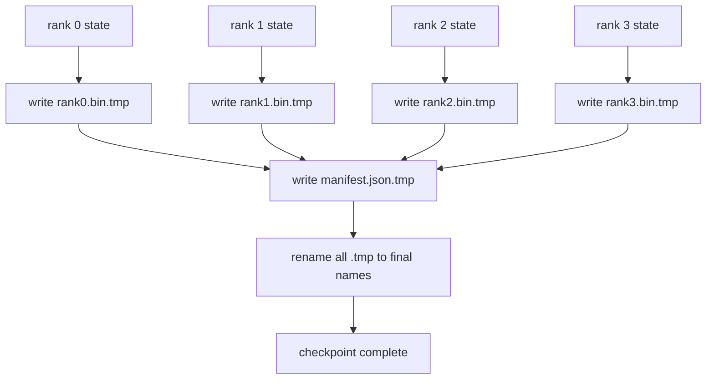

# Sharded Checkpoint and Atomic Resume / 分片 Checkpoint 与原子恢复

> 70B-parameter training job 每隔几小时就可能被 node failure 打断。checkpoint format 决定你损失 30 分钟还是 30 小时。sharded checkpoint 让每个 rank 并行写自己的 shard，并在 manifest 中记录 ownership。resume 时每个 rank 从自己的文件加载 shard，在相同 world size 上重构 state，optimiser 像什么都没发生一样继续 step。atomic write 防止半写完的 checkpoint 污染下一次 resume。

**类型：** 构建
**语言：** Python
**前置知识：** 第 19 阶段 Track C 第 42-49 课
**时间：** 约 90 分钟

## Learning Objectives / 学习目标

- 把 multi-rank checkpoint 保存为 per-rank shard file，加一个 manifest 记录哪个 rank 拥有什么。
- 使用 atomic write pattern（先写 temp path，再 rename），确保 crash mid-write 不会产生半成品 checkpoint。
- 从 manifest resume，并验证每个 rank 上 fp16 parameters 和 ZeRO optimiser state 都 byte-equal。
- 用 manifest schema 防住三个 failure modes：world-size change、shard count mismatch、partial write。

## The Problem / 问题

vanilla checkpoint 会把所有 parameters 和 optimiser state gather 到 rank 0，再写成单个文件。对于 70B model，这意味着 1.1 TB state 都要经过一个 rank 的 network port。写入期间其他 ranks 都 idle 等 gather。IO bandwidth 受最慢单个 GPU 的 network link 限制，而不是 aggregate。真实 cluster 上，gather-then-write 可能比前一小时训练还久，结果一天训练都写不出一个 checkpoint。

sharded checkpoints 反转模式：每个 rank 并行把自己的 shard 写到自己的文件。manifest 记录哪个 rank 拥有哪些 shard，resume 时把每个 shard 放回原位。aggregate write bandwidth 随 cluster 规模增长。一个通过单 rank 写要 4 小时的 1 TB checkpoint，通过 64 ranks 可以变成 4 分钟。同时 manifest 给 incompatible resumes 一个契约：world-size change 可检测，partial writes 可检测，load path 可以大声失败，而不是静默使用 stale data。

## The Concept / 概念



### Manifest schema / Manifest schema

```json
{
  "world_size": 4,
  "step": 1234,
  "wall_clock_seconds": 4521,
  "shards": [
    {"rank": 0, "path": "rank0.bin", "sha256": "...", "param_shard_offset": 0, "param_shard_numel": 65536},
    {"rank": 1, "path": "rank1.bin", "sha256": "...", "param_shard_offset": 65536, "param_shard_numel": 65536}
  ],
  "schema_version": 1
}
```

三个字段是承重的。`world_size` 让不同 size 上的 resume 大声失败，而不是静默破坏状态。每个 shard 的 `sha256` 捕获 partial 或 corrupted writes。每个 shard 的 `param_shard_offset` 和 `param_shard_numel` 让 loader 能在正确位置重构 flat parameter tensor。

### Atomic write / 原子写

标准模式：把每个 shard 写到 `<name>.tmp`，把 manifest 写到 `manifest.json.tmp`，对每个文件 fsync，然后 rename。在同一 filesystem 内，POSIX rename 是 atomic；新文件要么完整存在，要么旧文件仍在。final rename 前 crash，会让 previous checkpoint 保持 live。没有 atomic write，crash 可能留下 partial shard，同时 manifest 已经指向它，resume 时 optimiser state 会被破坏。

### Three failure modes the schema must defend against / schema 必须防住的三个失败模式

| Failure | Symptom | Defence |
|---------|---------|---------|
| World-size change | resume on N=8 with manifest from N=4 | world_size mismatch in manifest, fail loudly |
| Shard count mismatch | resume sees fewer rank*.bin files than shards in manifest | enumerate shards, verify every one exists |
| Partial write | shard file truncated mid-flush | sha256 verification on load |

每个 defence 都会尽早拒绝 bad load；否则就是 silent corruption，100 steps 后 loss 变成 NaN 才暴露。

### Why per-rank files, not one big file / 为什么是 per-rank files，而不是一个大文件

通过 `O_APPEND` 并发写一个文件在 POSIX 上对 byte-aligned writes 可行，但实践中一个 shard 内 offsets 跨 MB-sized regions，锁竞争会主导。per-rank files 没有 contention，并且在底层 filesystem 是 parallel（Lustre、GPFS）时能利用 striping。生产 stacks（DeepSpeed、FSDP、NeMo）都因此使用 per-rank files。

## Build It / 动手构建

`code/main.py` 实现：

- `ShardManifest` dataclass：包含上述 schema，并提供 `to_json`/`from_json`。
- `save_sharded(state_dict_per_rank, dir, step)`：用 atomic temp-then-rename pattern 把每个 rank 的 binary state 写到自己的文件，然后写 manifest。
- `load_sharded(dir, expected_world_size)`：读取 manifest，验证每个 shard 的 sha256，并返回 per-rank state dicts。
- round-trip test：构造 per-rank state，保存，加载，断言 byte-equal。

运行：

```bash
python3 code/main.py
```

输出：写出 4 个 shard files 和 manifest，然后 reload，并通过 byte-equal verification。

## Production patterns in the wild / 生产模式

三个模式会把 checkpoint 加固到可交付水平。

**Async write.** 生产 stacks 会在单独 thread 或 process 中发起 checkpoint write，让训练继续。barrier 在下一次 checkpoint：前一次 save 未完成前，不要开始下一次 save。DeepSpeed 的 `async_io` flag 正是做这件事。本课保持 synchronous write，是为了让步骤可见。

**Local fast disk first, then async upload.** 先写 local NVMe（快），再 async-upload 到 S3 或 GCS。两层模式让 in-cluster checkpoint 能快速 resume，同时把 durable copy 送到 off-cluster archive。manifest 携带 local path；upload manifest 携带 remote path。

**Rotation matters.** 生产 runs 通常保留最近 K 个 checkpoints（典型 3-5），并轮转最旧的。没有 rotation，磁盘会在 run 中途写满，下一次 checkpoint 失败。有 rotation 时，下一次 save 先删最旧 checkpoint，释放 budget。

## Use It / 应用它

生产模式：

- **DeepSpeed checkpointing.** `deepspeed.save_checkpoint(tag=step)` 写 per-rank files，并用 `latest` file 指向 active tag。
- **PyTorch FSDP checkpointing.** `torch.distributed.checkpoint` 用 `Planner` 决定 per-rank layout 并保存 sharded state。
- **NeMo.** 用统一的 `save_to_checkpoint` API 包装 DeepSpeed 和 FSDP，并添加 metadata。

## Ship It / 交付它

Lesson 81 会保存 end-to-end DDP+ZeRO run 的 sharded checkpoint，并在相同 world size 上 reload，证明 resume contract 成立。

## Exercises / 练习

1. 增加 async write：在 thread 中启动 save，让 training 继续。下一次 save 前阻塞等待前一次完成。
2. 增加 `last_5_steps` rotation：保留最近 5 个 checkpoints，保存新 checkpoint 前删除最旧的。
3. 增加 CRC-only fast verification path，用于 inner-loop reload（rotation 把一个 checkpoint 滚成新的 active checkpoint，不做 full sha256）。
4. 增加 cross-world-size load：从 N=4 manifest 读取、concat、再 re-shard 到 N=8。
5. 增加 fake S3 upload（第二个目录）并写 upload manifest，解释 two-tier storage policy。

## Key Terms / 关键术语

| 术语 | 常见说法 | 实际含义 |
|------|----------------|------------------------|
| Sharded checkpoint | "Per-rank save" | 每个 rank 并行写自己的 shard file |
| Manifest | "Index" | 记录 shard paths、offsets 和 sha256 的 JSON file |
| Atomic write | "tmp then rename" | 写入 .tmp 再 POSIX rename，crash 时旧文件仍 live |
| Partial write | "Truncated shard" | 写入期间 crash 产生 corrupt shard；sha256 捕获它 |
| Rotation | "Keep last K" | 写新 checkpoint 前删除最旧 checkpoint，控制磁盘使用 |

## Further Reading / 延伸阅读

- [DeepSpeed checkpointing](https://www.deepspeed.ai/tutorials/checkpointing/)
- [PyTorch torch.distributed.checkpoint](https://pytorch.org/docs/stable/distributed.checkpoint.html)
- [POSIX rename atomicity](https://pubs.opengroup.org/onlinepubs/9699919799/functions/rename.html)
- Phase 19 Lesson 78 - the ZeRO state this checkpoint is shaped to save
- Phase 19 Lesson 81 - the end-to-end demo round-trips the saved state
