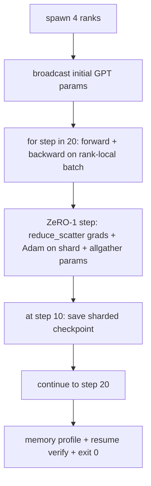

# End-to-End Distributed Training / 端到端分布式训练

> Lessons 76 到 80 各自构建了一个组件。本课是总装：一个 tiny GPT 在 4 个 simulated ranks 上训练，用 DDP 做 gradient sync，用 ZeRO-1 做 optimiser-state sharding，并在中点写 sharded checkpoint。demo 运行 20 steps，自终止，打印 loss curve 和 memory profile，并写出可恢复 checkpoint。

**类型：** 构建
**语言：** Python
**前置知识：** 第 19 阶段 Track C 第 42-49 课
**时间：** 约 90 分钟

## Learning Objectives / 学习目标

- 把 DDP（lesson 77）、ZeRO-1（lesson 78）和 sharded checkpoints（lesson 80）组合进一个 training loop。
- 在 4 个 simulated ranks 上，用小型 synthetic corpus 训练一个 2-layer transformer language model 20 steps。
- 打印 per-step loss table、per-rank memory profile，以及在相同 world size 上 byte-equal resume 的 checkpoint manifest。
- 解释这种组合：每个组件在前几课都可独立测试，本课证明它们能组合。

## The Problem / 问题

capstone 是证明各部分能拼在一起的证据。Lesson 76 实现 collectives。Lesson 77 把它们包装成 DDP。Lesson 78 用 reduce_scatter 分片 optimiser state。Lesson 79 分析 pipeline。Lesson 80 保存 sharded checkpoint。每课都有自己的 tests，能独立成立。真实 training run 会同时使用所有 primitives；如果组合错了，loss 会发散，checkpoint 会拒绝 resume，或者 per-rank memory 在应该下降时反而增长。

本课运行 end-to-end demo，并验证四个 invariants：(a) 20 steps 内 loss 在 float noise 范围内单调下降；(b) 每个 step 上每个 rank 都持有相同 parameter norm；(c) per-rank optimiser memory 等于 ZeRO-1 公式 12P/N bytes；(d) step 10 的 checkpoint 在 restart 时 byte-equal reload。demo 自终止：20 steps、单命令、exit 0。

## The Concept / 概念



### The mini GPT / mini GPT

模型刻意做小：2 个 transformer blocks、embed dim 32、4 attention heads、vocab 64、sequence length 16、batch 4，只有几千个 parameters。它大到足以覆盖所有 wiring decisions（multi-head attention 走标准 masked path；LayerNorm 有要同步的 weights；LM head 是独立 linear projection 回 vocab），也小到 4 个 CPU ranks 上 20 steps 能在几秒内完成。

### The composition rules / 组合规则

| Lesson piece | What it owns | What it leaves to the loop |
|--------------|--------------|----------------------------|
| DDP broadcast | Initial parameter sync | One call at construct time |
| ZeRO-1 step | Gradient sync, master copy update, parameter broadcast | One call per step replacing optimiser.step |
| Sharded checkpoint | Persist per-rank state, manifest with sha256 | Called on rank 0 with state collected via allgather |
| Training loop | Forward, backward, loss logging | Calls the three above in order |

loop 不知道 reduce_scatter 或 rendezvous files。ZeRO 和 checkpoint modules 暴露窄接口，loop 只负责组合。

### Why a tiny GPT and not just an MLP / 为什么用 tiny GPT 而不是 MLP

lesson 77 的 MLP 足以验证 gradient sync。tiny GPT 增加三件事：vocab 上的独立 LM head（本课为了清晰不 tie；完整 GPT 通常把 head 与 token embedding 绑定）、softmax+cross-entropy loss（比 MSE 有更多 numerical edge cases），以及不对称 forward（embeddings、attention、每层 MLP）。capstone 如果继续用 MLP，会隐藏组合是否正确处理 LayerNorm 或 embedding layer grad shape。

### Self-terminating means exit 0 / 自终止意味着 exit 0

loop 运行固定 20 steps 后退出。没有 `while True`，没有人工介入，也不依赖 external state resume。一个能无人值守运行、结束后留下完整 log 的 capstone，才证明系统 wiring 正确。如果任何组件 deadlock，demo 永远不返回，test rig 会抓住它。

## Build It / 动手构建

`code/main.py` 实现：

- `MiniGPT`：2-layer transformer，带 masked self-attention 和独立 LM head。
- `make_corpus(seed, total_tokens)`：确定性的 next-token-prediction data。
- `_train_worker`：每个 rank 一个 worker；广播 init params，运行 loop，调用 ZeRO step，并在 step 10 写 sharded checkpoint。
- `verify_resume`：main run 后在进程内 reload step-10 checkpoint，并断言 saved master shards 与 in-memory snapshot byte-for-byte 一致。
- `main`：编排整个 demo，打印 loss table、memory profile 和 verification result。

运行：

```bash
python3 code/main.py
```

输出：20 行 loss table、4 行 per-rank memory profile、checkpoint manifest，以及成功时的一行 "RESUME VERIFIED"。

## Production patterns in the wild / 生产模式

三个模式会补全真实 runs 的组合。

**Checkpoint every K minutes, not every K steps.** step time 会随 seq length 和 microbatch count 变化。10 分钟 checkpoint cadence 捕获的是同样的 compute，而不是同样的 step 数。本课为了简单使用 step-based；生产使用 wall-clock-based。

**Detect divergence early.** 生产 runs 会在 backward 后加 NaN guard 和 loss-spike detector；如果 loss 一步内跳涨超过 2x，就 rollback 到 previous checkpoint，而不是让 optimiser 继续走向退化状态。本课 loss curve 平滑，因此 guard 不会触发，但 hook 应该保留。

**Aggregate the memory profile across ranks.** 真实 runs 中 per-rank memory 会不同（最大 pipeline stage 所在 rank 持有更多 activations）。生产会记录 ranks 上的 max 和 mean；本课打印 per-rank，是为了展示公式匹配。

## Use It / 应用它

生产模式：

- **DeepSpeed.** 用一个 config 组合 DDP + ZeRO + pipeline + activation checkpointing。本课的组合是 DeepSpeed 形状的缩小版。
- **PyTorch FSDP.** native equivalent。`FullyShardedDataParallel` 配 `ShardingStrategy.SHARD_GRAD_OP` 是 ZeRO-2。
- **NeMo and Megatron-LM.** 为最大模型加入 tensor parallel；否则组合形状一致。

## Ship It / 交付它

完整 track 到这里结束。这 6 节课一起构成一个真实团队在采用 DeepSpeed 前应该先构建的 distributed-training subsystem；抽象已经对照 gloo 验证，failure modes 也已演练。Phase 17（infrastructure and production）是把它带到真实 cluster 的地方。

## Exercises / 练习

1. 添加 attention head 的 tensor-parallel split，并验证 loss 匹配 single-rank baseline。两个 ranks：每个 rank 一半 heads，对 attention output 做 allreduce。
2. 增加跨 4 个 microbatches 的 gradient accumulation，并证明 gradient 等于一个大 batch 的 gradient。
3. 增加 resume-from-step-10 path，实际继续训练到 step 20，并产生与原始 run 相同的 final loss。
4. 把 metrics export（loss、grad norm、step time）写到 JSONL，方便事后可视化。
5. 增加 NaN guard，在 loss spike 时 rollback 到 previous checkpoint，并用一倍 step LR multiplier 强制 spike 以演练 rollback。

## Key Terms / 关键术语

| 术语 | 常见说法 | 实际含义 |
|------|----------------|------------------------|
| End-to-end | "Wire it all up" | 一次 run 组合每个组件，而不是每个组件各跑 unit test |
| Memory profile | "GB per rank" | 每个 rank 上 params、grads、optimiser state 占用的 bytes |
| Resume contract | "Save and load" | checkpoint round-trip 后 per-rank state byte-equal |
| Self-terminating | "Bounded run" | 固定 step count，完成时 exit 0，没有人工介入 |

## Further Reading / 延伸阅读

- [DeepSpeed end-to-end training tutorial](https://www.deepspeed.ai/getting-started/)
- [PyTorch FSDP advanced tutorial](https://pytorch.org/tutorials/intermediate/FSDP_advanced_tutorial.html)
- [Megatron-LM training script reference](https://github.com/NVIDIA/Megatron-LM)
- Phase 19 Lessons 76-80 - each piece this lesson composes
- Phase 17 - moving the composition to a real cluster
