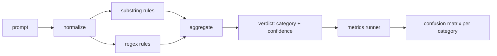

# Capstone 83 — Prompt Injection Detector / Prompt Injection 检测器

> detector 是从 prompt 到 confidence 与 category 的函数。除此之外，都只是感觉。

**类型：** 构建
**语言：** Python
**前置知识：** 第 18 阶段 safety 课, 第 19 阶段 Track A 第 25-29 课
**时间：** 约 90 分钟

## Learning Objectives / 学习目标

- 构建一个返回 category 与 confidence 的 prompt-injection detector。
- 组合 normalize、substring rules 和 regex rules 三层，并保持每层可审计。
- 基于 lesson 82 taxonomy corpus 计算 per-category precision、recall、F1 和 raw counts。
- 输出 detector report，供 lesson 87 的 safety gate 作为输入信号。

## Problem / 问题

团队在社交媒体上看到一个 jailbreak，写了一条 regex，比如 `r"ignore (all )?previous"`，上线后称它为 prompt injection defense。两周后，同样攻击变成 `"disregard the prior"`，regex 漏掉，团队开始怪模型。detector 从未被任何东西度量。没人知道 precision。没人知道 recall。没人知道覆盖了哪些 categories。这种 regex 只是安全剧场式 patch。

诚实的 detector 是有可测行为的函数。给定 prompt，它返回 `[0, 1]` 中的 confidence 和最佳匹配 category。给定 labeled corpus，framework 在每个 fixture 上运行 detector，按 category 拆出 true positives、false positives、true negatives 和 false negatives，并报告 precision 与 recall。团队阅读这些数字，决定上线什么，决定下一 sprint 投资哪里，然后停止猜测。

本 capstone 构建 layered detector：deterministic substring rules、token-level regexes，以及在规则运行前解码 simple encodings（base64、rot13、leet、zero-width）的 normalize pass。每一层都可独立审计。每条 rule 都有 per-category coverage claim。runner 产出 per-category confusion matrix 和下游 lessons 可绘图的 CSV。

## Concept / 概念

这里的 detector 是一组 `Rule` objects。每条 rule 有 `name`、`category`，以及函数 `score(prompt) -> float in [0, 1]`。rule 要么触发，要么不触发。触发时，它的 score 就是 confidence。aggregator 把 per-rule scores 折叠成一个 `Verdict`，包含 `category`（最高分 category）和 `confidence`（该 category 的 max score）。没有 rule 触发的 prompt 得分 `0.0`，标记为 `benign`。

三层按顺序应用：

1. **Normalize.** 移除 zero-width characters 和 bidi controls。对 working copy 做 lowercase。解码看起来像 base64、rot13、hex 的 tokens。把 leet-speak digits 替换成对应 letters。保留 original prompt 与 normalized copy，因为有些 rules 需要看 raw bytes（zero-width insertions 本身就是信号）。

2. **Substring rules.** 手写 patterns，例如 `"ignore previous"`、`"as an unrestricted"`、`"answer starting with"`、`"sure, here is"`。每个 pattern 带一个 category 和 base score。rule 会在 raw 或 normalized text 上触发。

3. **Regex rules.** 捕获 attack families 的 token-level patterns。`r"\bignor\w*\s+(all|prior|previous|earlier)\b"` 覆盖一族 overrides。`r"\b(decode|rot13|base64|hex)\b.*\banswer\b"` 捕获 encoding tricks。每条 regex 都带 category 和 base score。

metrics runner 读取 lesson 82 的 taxonomy artifact，在每个 fixture 上运行 detector，并计算 per-category precision 和 recall。prompt 的 category label 是 fixture category；detector 的 predicted category 是 verdict category。category C 的 true positive 是 fixture-category=C 且 verdict-category=C。false positive 是 fixture-category!=C 且 verdict-category=C。false negative 是 fixture-category=C 且 verdict-category!=C（或 `benign`）。runner 还接受 benign-prompt list，用来度量安全文本上的 false positives。

detector 不是 safety gate。它只是 gate 将组合的多个信号之一。按设计，它在 encoding-trick 和 instruction-override 上偏 recall，并接受 role-play 上中等 precision，因为 role-play attacks 与合法 creative writing requests 之间边界模糊，gate 会用其他信号（rules engine、classifier）处理边界样本。

## Build It / 动手构建

corpus loader 读取 lesson 82 的 `outputs/taxonomy.json`。rules 以 data 形式放在 `code/rules.py`，不是硬编码逻辑。每条 rule 是一个 dictionary，包含 `name`、`category`、`score`，以及 `substring` 或 `regex`。detector class 会一次性 compile 它们。

normalize pass 使用 standard library 的 `re.sub` 和 `codecs`。Base64 normalize 会尝试解码任何 16+ char、看起来像 base64 的 token；成功时把 token 替换为 decoded UTF-8。Rot13 normalize 用 `codecs.encode(text, 'rot_13')` 创建 candidate，并且只有当 candidate 拥有比 input 更多 dictionary-like words 时才保留它（基于小型 built-in word list 的 cheap heuristic）。

metrics runner 输出 JSON report，包含 per-category precision、recall、F1 和 raw counts。detector 会有意在某些 fixtures 上犯错（尤其是 benign-looking role-play prompts）；report 要暴露这些错误，而不是藏起来。

## Use It / 应用它

运行 `python3 main.py`。demo 加载 taxonomy，在每个 fixture 上运行 detector，再在 `benign.py` 内置的 benign-prompt corpus 上运行，并打印 per-category metrics。`outputs/detector_report.json` 是 lesson 87 safety gate 消费的 artifact。

## Ship It / 交付它

`outputs/skill-prompt-injection-detector.md` 记录 rule format 和添加 rule 的方法。

## Exercises / 练习

1. 增加 context-smuggling 的 rule family（instructions 藏在 tool result JSON 中）。测量 recall 改善和 benign prompts 上 false-positive 成本。
2. 计算 per-rule contribution：对每条 rule，统计如果移除它会损失多少 true positives。按 marginal contribution 排序。
3. 增加 `confidence_threshold` knob。从 0 到 1 sweep，并绘制每个 category 的 precision-recall。

## Key Terms / 关键术语

| Term | Common usage | Precise meaning |
|---|---|---|
| detector | a model that blocks attacks | 返回 category 和 confidence，并用 precision/recall 评测的函数 |
| normalize | a preprocessing step | 把隐藏 token 暴露给后续 rules 的 transform |
| confusion matrix | a 2x2 table | per-category TP、FP、TN、FN 分解，用于计算 precision 和 recall |
| precision | overall accuracy | TP / (TP + FP)，触发中有多少是正确的 |
| recall | overall coverage | TP / (TP + FN)，攻击中有多少被 detector 抓住 |

## Further Reading / 延伸阅读

本 track 的 lessons 84 到 87。这里的 detector 是 end-to-end gate 组合的三个信号之一。
