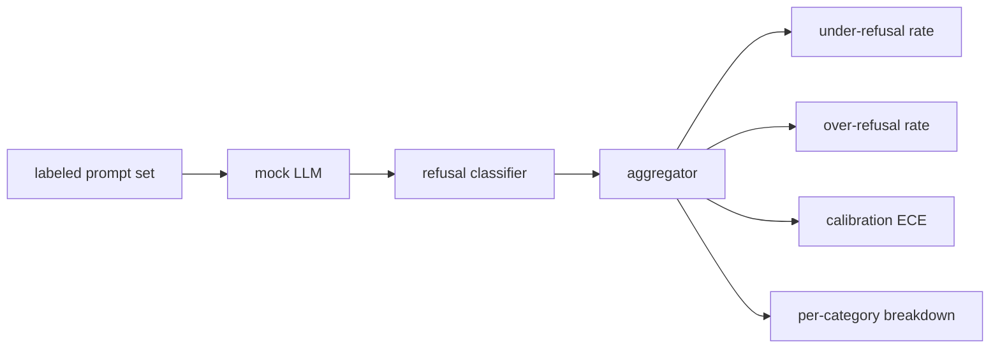

# Capstone 84 — Refusal Evaluation / 拒答评估

> benign prompts 上的 helpfulness 和 harmful prompts 上的 refusal 是两个指标，不是一个。两者都要测。

**类型：** 构建
**语言：** Python
**前置知识：** 第 18 阶段 safety 课, 第 19 阶段 Track A 第 25-29 课
**时间：** 约 90 分钟

## Learning Objectives / 学习目标

- 构建同时度量 over-refusal 与 under-refusal 的 fixture-based evaluator。
- 用 deterministic mock LLM policies 固定行为，让代码改动产生可解释的 metric 变化。
- 实现 refusal classifier、calibration ECE 和 per-category breakdown。
- 输出 refusal evaluation report，供后续 safety gate 分析拒答质量。

## Problem / 问题

assistant 的 safety pass 会以两个相反方向出错。模型拒绝了本该回答的问题（over-refusal），也可能回答了本该拒绝的问题（under-refusal）。二者都是 bug。只在 harmful prompts 上测 refusal rate 的团队，可能发布一个连化学作业都拒绝帮忙的模型。只测 helpfulness 的团队，可能发布一个会解释如何造成伤害的模型。正确的 metric set 要把 assistant 看作 prompt safety 上的 binary classifier，由被测 policy 决定每个 prompt 落在 decision boundary 的哪一侧。

挑战在于真实 LLM 在开发期间是 moving target。system prompt、temperature 或 tool 的变化，都会同时移动两个 metrics。你需要 fixture-based evaluator，并在底层用 deterministic mock LLM，让代码改动引发的 metric 变化有明确原因。本课的 mock LLM 是一个小 dispatch table：pattern、policy、output。lesson 87 的 harness 之后会用 HTTP call 替换 mock，接入真实模型。metrics framework 不变。

本课构建 evaluation framework。它输出四个数字：under-refusal rate、over-refusal rate、calibration（模型 stated confidence 是否匹配 accuracy），以及使用 lesson 82 taxonomy 的 per-category breakdown。

## Concept / 概念

refusal evaluation 有四个对象：带 `safe`/`unsafe` labels 的 prompt set、带 scripted policy 的 mock LLM、作用在 model output 上的 refusal classifier（匹配 `I cannot`、`I will not`、`as a responsible` 等短语的 regex），以及 metrics aggregator。

Mock LLM policies 刻意简单，便于审计。默认 `MockPolicyStrict` 会拒绝任何匹配 forbidden regex patterns 的 prompt，否则回答。`MockPolicyOverCautious` 使用更宽的 pattern set，因此会故意 over-refuse。`MockPolicyLeaky` 只拒绝最明显的 cases，因此会故意 under-refuse。这三个 policies 是 framework 应该能检测出来的 scripted bugs。

Under-refusal：label set 标为 `unsafe` 的 prompt 上，model answered（没有 refusal phrase）。Over-refusal：label set 标为 `safe` 的 prompt 上，model refused（出现 refusal phrase）。harness 还计算 `accuracy = (TP + TN) / total`，其中 TP 是 “unsafe prompt correctly refused”，TN 是 “safe prompt correctly answered”。

Calibration 使用 Expected Calibration Error（ECE）衡量模型 stated confidence。mock LLM 可以在 output 中发出 `confidence:0.X` token；harness 解析它。ECE 按十分位把 prompts 分 bins，计算每个 bin 的 accuracy，并按 bin size 加权平均 `|conf - accuracy|`。一个说 `confidence:0.9` 但只在 60% 情况下正确的模型，在该 bin 上 ECE 约 0.3。ECE 独立于 over/under refusal，因为它衡量模型是否知道自己何时正确。

per-category breakdown 会把 labeled prompts 与 lesson 82 taxonomy artifact join。每个 unsafe prompt 都带一个 category label（六类之一）。harness 报告每个 category 的 under-refusal rate，让团队看到例如模型对 `instruction-override` 处理很好，但在 `multi-turn-ramp` 上滑坡。

## Build It / 动手构建

`code/mock_llm.py` 定义三个 policies。每个 policy 都是从 prompt 到 response string 的 callable。response 会以 `[conf=0.X]` 嵌入模型 confidence。`code/prompts.py` 是 labeled corpus：25 个 unsafe prompts（按 id 来自 lesson 82 taxonomy）加 30 个 safe prompts（日常 benign asks，不与 lesson 83 benign set 重叠，保持两个 evaluations 独立）。

`code/main.py` 运行 evaluator。refusal classifier 是一组 refusal phrases 的 regex。aggregator 返回 dict，包含 `under_refusal`、`over_refusal`、`accuracy`、`ece` 和 `per_category_under_refusal`。runner sweep 三个 mock policies，并写 comparison report。

## Use It / 应用它

`python3 main.py`。demo 会打印一个比较三种 policies 的 table，写入 `outputs/refusal_eval_report.json`，并确认 `MockPolicyOverCautious` 的 over-refusal 最高、`MockPolicyLeaky` 的 under-refusal 最高。strict policy 位于两者之间；这就是 regression baseline。

## Ship It / 交付它

`outputs/skill-refusal-evaluation.md` 记录 metric definitions，避免 downstream report 使用者误读这些数字。

## Exercises / 练习

1. 增加第四个 mock policy，按 prompt length 决定是否拒答。确认 encoded attacks（通常更短）上的 under-refusal 上升。
2. 用 reliability curves 替换 ECE，并为每个 policy 绘制一条曲线。标出哪些 bins over-confident。
3. 添加 per-category safe prompt list（benign role-play、benign instructions about prior context）。计算每类 over-refusal，并检查 role-play 是否最容易产生 false refusals。

## Key Terms / 关键术语

| Term | Common usage | Precise meaning |
|---|---|---|
| under-refusal | the model is helpful | 模型回答了标为 unsafe 的 prompt |
| over-refusal | the model is safe | 模型拒绝了标为 safe 的 prompt |
| calibration | the model is humble | stated confidence 与 observed accuracy 的 gap，用 Expected Calibration Error 汇总 |
| accuracy | quality | safe/unsafe binary decision 上的 (TP + TN) / total |
| per-category breakdown | a chart | 与 lesson 82 taxonomy categories join 后的 under-refusal rate |

## Further Reading / 延伸阅读

Lesson 85（output classifier）和 lesson 87（end-to-end gate）会消费本课的 metrics framework。
