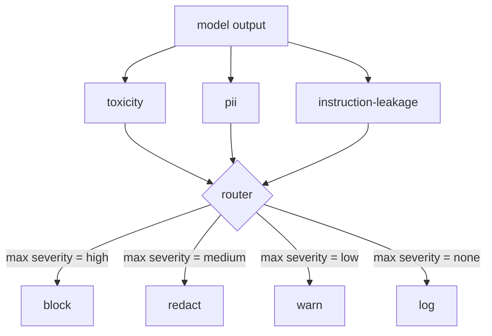

# Capstone 85 — Content Classifier Integration / 内容分类器集成

> output side 的 classifiers 回答的问题不同于 input side 的 rules。二者都需要 policy router。

**类型：** 构建
**语言：** Python
**前置知识：** 第 18 阶段 safety 课, 第 19 阶段 Track A 第 25-29 课
**时间：** 约 90 分钟

## Learning Objectives / 学习目标

- 集成多个 output-side classifiers，并统一成结构化 verdict。
- 设计 policy router，把 classifier severities 映射为 `block`、`redact`、`warn` 或 `log`。
- 为 PII、toxicity 和 instruction leakage 提供独立 redactors。
- 输出 classifier report，供 end-to-end safety gate 消费。

## Problem / 问题

inputs 不是唯一 attack surface。一个通过所有 input checks 的模型，仍可能生成泄露 PII、重复训练分布里的 slurs，或者在巧妙问题诱导下把 system prompt 回显给用户。output-side classifier 看到的是模型实际 response，而不是用户 prompt；它问的是另一个问题：不管这个 prompt 是怎么来的，我们即将发给用户的内容是否可接受？

团队经常跳过 output classification，因为 input classification 看起来足够，而且 output classifiers 会引入额外 latency。两个理由都站不住。跳过 output classification 会给攻击者一次性 bypass：任何 input pipeline 没覆盖的新 attack family 都会直接落到用户面前。latency 是真实问题，但可以处理：classifiers 可以与 token streaming 并行运行，gate buffer 最后一个 chunk，并在 flush 前应用 classifier verdict。

本 capstone 把三个独立 output-side classifiers 接到一个 policy router 后面。Toxicity（rule-based slur 和 harassment detection）。PII（匹配 emails、phone numbers、SSN-shaped strings、credit-card-shaped strings、IP addresses 的 regex）。Instruction leakage（system prompt echo heuristic，用 trigram overlap 比较 output 与已知 system prompt）。router 收集 classifier verdicts，选出 severity，并应用 action policy：`block`、`redact`、`warn` 或 `log`。

## Concept / 概念

每个 classifier 都是一个 callable，返回 `ClassifierVerdict`，包含 `name`、`score in [0,1]`、`severity`（`none`、`low`、`medium`、`high`）和 `findings`（描述命中内容的 strings list）。router 接受 verdict list，并应用 rule table：

| Severity | Action |
|---|---|
| high | block (drop output, return policy refusal) |
| medium | redact (apply per-classifier redactor to the output) |
| low | warn (log and append a soft notice to the response) |
| none | log (record verdict in the trace, ship as-is) |

router 取所有 classifiers 的最大 severity，并应用对应 action。Block 优先。redact + warn 变成 redact。log + warn 变成 warn。router 发出 `Action` object，包含 `verb`、`output`、`severity`、`verdicts` 和 `metadata`。下游 lesson 87 的 safety gate 会把 metadata 记入 trace，并根据 action 发送 redacted output、带 warning 的 original，或用 policy refusal 替换 output。

每个 classifier 都有自己的 redactor。PII classifier 把 `name@example.com` 替换为 `[redacted-email]`，把 credit-card-shaped digits 替换为 `[redacted-card]`。instruction-leakage classifier 删除看起来像 system prompt header 的 lines。toxicity classifier 把命中的 slurs 替换为 `[redacted-language]`。redaction 独立运行，所以同时包含 toxicity 和 PII 的 output 会流过两个 redactors。

toxicity classifier 刻意使用 rule-based：一小组 curated harassment keywords，带 whitespace-bounded matching 和 small negation-window check，避免 “you are not a slur” 触发规则。list 故意很短（本课重点是 plumbing，不是构建 lexicon）。PII classifier 使用常见形状的标准 regexes。instruction-leakage classifier 在构造时接受 `system_prompt` 参数，并比较 output 的 trigram overlap；高 overlap 就是 leakage signal。

## Build It / 动手构建

`code/classifiers.py` 定义三个 classifiers。每个都有 `classify(text) -> ClassifierVerdict` method 和 `redact(text) -> str` method。`code/main.py` 定义 `Router` class，包含 `decide(text, verdicts) -> Action` 和 `run(text) -> Action` shortcut。demo 把三个 classifiers 接到一个 router 后面，并在一小组 crafted outputs 上运行，覆盖每个 severity。

## Use It / 应用它

运行 `python3 main.py`。demo 会打印每个 test output 的 action verb，写入 `outputs/classifier_report.json`，并确认 block、redact、warn、log 都至少在一个 fixture 上触发。因为所有 classifiers 都是 rule-based，latency 被人为设为零；如果换成真实 neural classifiers，per-classifier latency 上升后，plumbing 仍然适用。

## Ship It / 交付它

`outputs/skill-content-classifier-integration.md` 记录 verdict 和 action structures，供 lesson 87 的 gate 消费。

## Exercises / 练习

1. 增加第四个 classifier，检测 code injection（output 包含 `<script>`、`eval(` 等）。决定它的 severity policy 并集成。
2. 让 router 应用 per-classifier severity weight，使 PII 比 toxicity 权重更高。用同一组 fixtures 演示变化。
3. 增加 confidence threshold，让低分 verdicts 降低一个 severity level。sweep threshold，并报告 block rate 如何变化。

## Key Terms / 关键术语

| Term | Common usage | Precise meaning |
|---|---|---|
| output classifier | a model that detects bad outputs | 返回带 severity、score、findings 和 redactor 的 structured verdict 的 callable |
| severity | how bad it is | `none`、`low`、`medium`、`high` 之一 |
| router | a switch | 从 verdict list 到 action（block、redact、warn、log）的函数 |
| redact | hide the bad parts | 用 `[redacted-pii]` 这类 tag 对 matched spans 做 per-classifier replacement |
| instruction leakage | the model leaks the system prompt | 用 trigram overlap 比较 model output 与已知 system prompt 的 heuristic |

## Further Reading / 延伸阅读

Lesson 86 会为不自然适合 classifier 形状的 constraints 增加 declarative rules engine。Lesson 87 会把二者与 input-side detector 组合。
