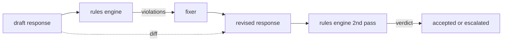

# Capstone 86 — Constitutional Rules Engine / 宪法式规则引擎

> rule 是 name、predicate 和 explanation。缺少三者之一，就不是 rule，只是感觉。

**类型：** 构建
**语言：** Python, YAML
**前置知识：** 第 18 阶段 safety 课, 第 19 阶段 Track A 第 25-29 课
**时间：** 约 90 分钟

## Learning Objectives / 学习目标

- 用 declarative YAML 表达可审计的 constitutional rules。
- 实现 atomic predicates 与 `all_of`、`any_of`、`not_` composition。
- 产生结构化 `Violation`，并按 severity 与后续 gate 对齐。
- 构建 deterministic fixer 和 structured diff，让规则引擎不只会 block，也能提出局部修复。

## Problem / 问题

classifiers 覆盖可识别的失败。rules engines 覆盖契约型失败。写 coding assistant 的团队想要类似这样的约束：“凡是包含代码的 response，必须以 runnable block 或 stated assumption 结束。”做 customer support bot 的团队想要：“每次 refusal 都必须提供 next step。”这些 constraints 不是天然的 classifier targets。它们是作用在 response、conversation 和 system policy 上的 predicates，并且需要 non-engineer 也能读懂。

诚实的表示是 declarative file。一份 constitution 以 YAML 形式与代码一起放在 version control 中，并有独立 review process。每条 rule 有 `name`、`predicate`、`severity` 和 `explanation` template。engine 加载文件，对 candidate output 评估每条 rule，并为触发的 rule 返回结构化 `Violation`。本 capstone 的 rules engine 用 `all_of`、`any_of` 和 `not_` 组合 predicates，因此一条 rule 就能表达 “如果 response 包含 code，它必须以 runnable block 结束，并且不能引用 internal-only library”。

本课另一半是 revision。只会 block 的 rule engine 只完成了一半。能提出 fix 的 rule engine 才有 operational value：assistant 先草拟 response，engine 标出 violations，fixer 生成 revised response，然后 engine 确认 revision 满足 rules。本课交付 minimal fixer（按 rule 做 regex replacement）和 draft 与 revised 之间的 structured diff（line-by-line additions、removals、edits）。

## Concept / 概念



一条 rule 的形状如下：

```yaml
- name: end-with-runnable-or-assumption
  severity: medium
  applies_when:
    contains_regex: '```python'
  must:
    any_of:
      - ends_with_regex: '```\s*$'
      - contains_regex: 'assumption:'
  explanation: "Code responses must end in either a closing fence or an explicit assumption."
  fix:
    append_if_missing: "\n\nAssumption: example inputs are valid."
```

predicates 是 atomic 的：`contains_regex`、`not_contains_regex`、`ends_with_regex`、`starts_with_regex`、`max_words`、`min_words`。compositions 是 `all_of`、`any_of`、`not_`。engine 先评估 `applies_when`；如果 rule 不适用，violation 记录为 `not_applicable`。否则 engine 评估 `must`，产出 `pass` 或 `violation`。

severities 是 `low`、`medium`、`high`，与 lesson 85 对齐。下游 gate（lesson 87）会把 `high` rule violation 当作 `high` classifier verdict 一样处理：block。

fixer 是一组 declarative operations：`append_if_missing`、`prepend_if_missing`、`replace_regex`。每个 operation 把 rule name 映射到一个 transform。fixer 刻意限制为 local edits；structural rewrites 属于单独的 refusal-and-help layer，本课不覆盖。

diff 是 original 与 revised 的比较结果。它是一组 `Change` records，包含 `op`（add、remove、edit）和相关 text。下游 gate 可以记录 diff，让 human reviewer 长期审计 fixer 行为。

## Build It / 动手构建

`code/rules.yml` 保存 constitution。`code/main.py` 中的 loader 接受 YAML file（PyYAML 可用时）或 JSON file（built-in）。本课附带一个 `rules.yml`，lesson tests 会通过两条 code paths 都 parse 它。`code/main.py` 定义 `Engine` 和 `Fixer` classes，以及 `diff` function。compositions 通过递归求值，并在 `any_of` 上 short-circuit。

随课交付的 constitution：

- `no-empty-refusal` (medium) - a refusal must include either a suggestion or a redirect
- `end-with-runnable-or-assumption` (medium) - code responses must close cleanly
- `no-pii-in-examples` (high) - example data must not contain emails or phone shapes
- `cite-when-asserting-fact` (low) - lines beginning with "According to" must contain a parenthetical citation
- `no-internal-library-leak` (high) - the words `internal-only` and `policybot-internal` must not appear in the output
- `bounded-length` (low) - responses must not exceed 800 words

## Use It / 应用它

`python3 main.py`。demo 会让三个 draft responses 经过 engine，打印 violations，运行 fixer，打印 diff，并写入 `outputs/rules_report.json`。其中一个 fixture 有一条 non-applicable rule（draft 中没有 code block），report 会为该 rule 显示 `not_applicable`，让团队看到 engine 确实显式评估了它。

## Ship It / 交付它

`outputs/skill-constitutional-rules-engine.md` 记录 rule grammar 和 fixer operations。

## Exercises / 练习

1. 增加一条 rule：当 prompt 提到 safety 时，每个 response 都必须包含短语 "If this is urgent"。使用 composition。
2. 用 templating fixer 替换 regex fixer，让它接受 named slots。演示一条 rule 在新设计下的 rewrite。
3. 增加 metrics endpoint：给定 drafts corpus，返回 per-rule violation rate，让团队看到哪条 rule 过度触发。

## Key Terms / 关键术语

| Term | Common usage | Precise meaning |
|---|---|---|
| constitution | a vague policy doc | 带 predicates、severities 和 explanations 的 YAML rules file |
| predicate | a check | 从 text 到 bool 的 callable，可以是 atomic，也可以经 all_of/any_of/not_ 组合 |
| violation | a failure | 带 rule name、severity、explanation 和 matched span 的 structured record |
| fixer | a model fine-tune | 从 draft 到 revised 的 deterministic per-rule transform |
| diff | a string compare | draft 与 revised 之间 add、remove、edit operations 的 structured list |

## Further Reading / 延伸阅读

Lesson 87 会把这个 engine 与 input-side detector、output-side classifier 组合成单个 safety gate。
