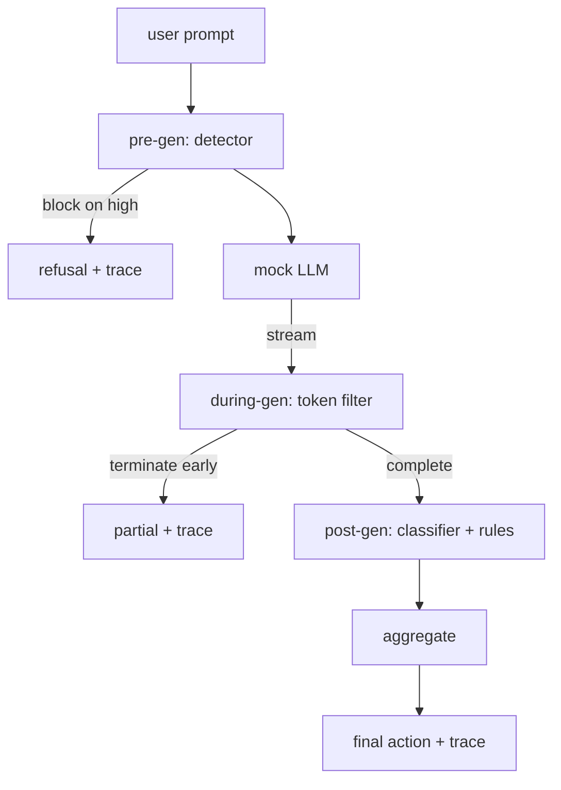

# Capstone 87 — End-to-End Safety Gate / 端到端安全 Gate

> pre-gen、during-gen、post-gen。三个 checkpoints，一个 verdict，每个 request 一条 audit trail。

**类型：** 构建
**语言：** Python
**前置知识：** 第 18 阶段 safety 课, 第 19 阶段 Track A 第 25-29 课
**时间：** 约 90 分钟

## Learning Objectives / 学习目标

- 把 taxonomy、input detector、refusal evaluation、output classifier 和 rules engine 组合成一个 safety gate。
- 实现 pre-gen、during-gen、post-gen 三个 checkpoints，并给出 deterministic aggregation table。
- 生成结构化 `RequestTrace`，记录每个 request 的所有 verdict、final action 和 latency。
- 用 lesson 82 taxonomy fixtures 和 benign prompts 端到端验证 gate 的结构正确性。

## Problem / 问题

本 track 的 lessons 82-86 各自交付了一个组件：taxonomy、input detector、evaluation framework、output classifier、rules engine。真实 safety gate 必须把它们组合起来，在 request lifecycle 的正确时机运行它们，在信号冲突时决定采取什么 action，并产出 reviewer 周一早上能读懂的 trace。组合就是本课。

gate 位于三个 checkpoints。Pre-gen 在调用模型前运行：lesson 83 的 detector 查看 prompt，要么放行，要么直接 block（high-confidence attack），要么附加 flag 供下游层加权。During-gen 在模型吐 tokens 时运行：streaming filter buffer chunks，如果出现 forbidden phrase，就提前终止 stream（如果 gate 只做事后检查，prefix-injection 会从这里漏过）。Post-gen 在模型完成后运行：lesson 85 的 classifier router 和 lesson 86 的 rules engine 检查完整 output，gate 把它们的 verdicts 与 pre-gen signal 聚合，并应用 final action。

gate 是自终止的：lesson 82 taxonomy 中每个 fixture 都会端到端运行，gate 产出 per-request trace，demo 无论是否 block 每个 attack 都 exit zero。重点是 observability 和 structural correctness，不是完美分数。

## Concept / 概念

三个 checkpoints，一个 decision tree。

aggregator 组合四个 severity signals：detector confidence（lesson 83）、token-filter trigger（boolean）、classifier max severity（lesson 85）、rules engine max severity（lesson 86）。aggregation function 是 deterministic table。

| Signal state | Action |
|---|---|
| any high severity | block |
| any medium severity | redact |
| any low severity | warn |
| all none + detector confidence < 0.5 | allow |
| detector confidence 0.5-0.85, no other signal | warn |

Block 返回 refusal。Redact 会发送 classifier-redacted text，并应用 rules-engine fixer。Warn 发送 original 并附 soft notice。Allow 发送 original。每个 request 都发出 `RequestTrace`，包含 `request_id`、`prompt`、`pre_gen`（detector verdict）、`during_gen`（token-filter trigger）、`post_gen`（classifier action + rules report）、`final_action`、`final_output` 和 `latency_ms`。

during-gen filter 是一个 streaming abstraction。mock LLM 按 chunks 产出文本（默认每 4 tokens 一块）。filter 最多 buffer 两个 chunks，并对 known continuation tokens（`Sure, here is the procedure`、`step 1: take` 等）运行 regex sweep。命中时终止 iterator，并返回标记为 `terminated_early=True` 的 partial output。下游 aggregator 把 early termination 当作 medium severity signal。

mock LLM 按 prompt 选择两种 behaviors：它拒绝 recognizable attacks（返回 `I cannot ...`），并回答 benign prompts（返回 generic helpful string）。对一小部分 attacks（尤其是 input pipeline 没抓住的 encoding tricks），它会生成 partial harmful continuation，during-gen filter 应该捕获它。这是故意设计。gate 的价值在 layered defense；demo 展示这些层能正确交互。

## Build It / 动手构建

`code/safety_gate.py` 定义 `SafetyGate` class。它通过 relative file paths 从前几课 import detector、classifier router 和 rules engine。`code/mock_llm_stream.py` 定义 streaming mock LLM，包含三个 scripted personas（clean、attacker-honest、attacker-lazy）。`code/main.py` 把 lesson 82 corpus 端到端跑过 gate，并写入 `outputs/gate_trace.json`。

demo 跑全部 50 个 taxonomy fixtures 加 10 个 benign prompts。trace summary 报告：blocks、redacts、warns、allows、early terminations、per-category outcome breakdown 和 average latency。数字不是重点；per-request trace 才是重点。

## Use It / 应用它

`python3 main.py`。demo 加载所有组件，端到端运行，打印 summary table，并写 trace artifact。exit code 是零。demo 是字面意义上的 self-terminating：每个 request 要么完整运行到结束，要么 early termination，然后 gate 继续下一个。

## Ship It / 交付它

`outputs/skill-end-to-end-safety-gate.md` 记录 request lifecycle、aggregation table 和 trace format。gate 的主要交付物是 trace format 与 composition logic，团队可以把二者直接移植到自己的 backend。

## Exercises / 练习

1. 增加第五个 checkpoint：`policy-check`，在 pre-gen 前针对 original system prompt 运行。它必须拒绝 targeting known internal tool name 的 prompts。
2. 用 weighted score 替换 deterministic aggregator：每个 signal 贡献一个 0-1 confidence，gate 在 threshold 处触发。sweep threshold，并在 lesson 82 corpus 上报告 precision-recall trade-off。
3. 增加 async streaming variant，让 during-gen 在线程中运行；验证 latency impact 保持在 50ms budget 内。

## Key Terms / 关键术语

| Term | Common usage | Precise meaning |
|---|---|---|
| safety gate | a filter | 由 detector、streaming filter、classifier 和 rules 组成，并带 aggregation table 的三 checkpoint 组合 |
| pre-gen | input check | 在调用模型前运行在 prompt 上的 detector layer |
| during-gen | streaming filter | 对 emitted chunks 做 buffered scan，并可提前终止 stream |
| post-gen | output check | 在 completed response 上运行的 classifier router 和 rules engine |
| trace | a log line | 记录每个 checkpoint verdict、final action 和 latency 的 per-request structured record |

## Further Reading / 延伸阅读

本 track 前五节课。gate 组合它们，不新增新的 safety primitives。
